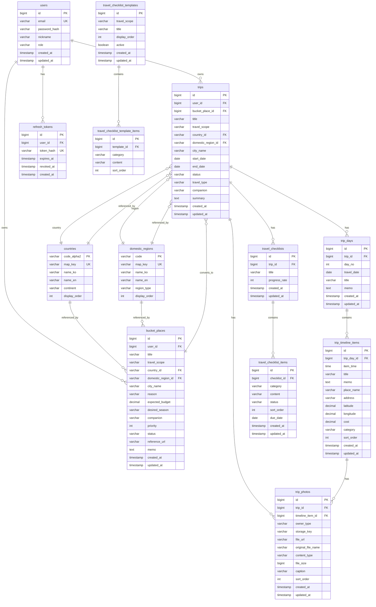

# Travel Archive ERD 및 테이블 명세서

> **초기 설계 산출물**: 현재 Flyway migration과 완전히 일치하지 않을 수 있다. DB 생성/변경에 직접 사용하지 말고 `docs/README.md`의 권위 순서를 따른다.

> **작성 기준**: 2주차 개발 완료 시점 (2026-05-21)
> **DBMS**: PostgreSQL 16
> **설계 방식**: JPA/Hibernate ORM 기반 엔티티 중심 설계
> **스키마 관리**: JPA `ddl-auto` (dev: `update`, prod: `validate`)

---

## 1. ERD (Entity Relationship Diagram)



---

## 2. 테이블 상세 명세

### 2.1 `users` — 사용자

> **JPA 엔티티**: `com.travelarchive.user.User`
> **상속**: `BaseEntity` (created_at, updated_at 자동 관리)

| 컬럼명 | 타입 | NULL | 기본값 | 제약 | 설명 |
|--------|------|------|--------|------|------|
| id | BIGINT | N | auto | PK | `@GeneratedValue(IDENTITY)` — Surrogate Key |
| email | VARCHAR(255) | N | | UK | 로그인 ID. `@Column(unique=true, nullable=false)` |
| password_hash | VARCHAR(255) | N | | | BCrypt 해싱된 비밀번호 |
| nickname | VARCHAR(80) | N | | | 화면 표시명. `@Column(length=80)` |
| role | VARCHAR(30) | N | `USER` | | 권한 (`USER` / `ADMIN`) |
| created_at | TIMESTAMP | N | | | `BaseEntity` — `@PrePersist` 자동 설정 |
| updated_at | TIMESTAMP | N | | | `BaseEntity` — `@PreUpdate` 자동 갱신 |

**관계**: `1:N` → `trips`, `bucket_places`, `refresh_tokens`

---

### 2.2 `trips` — 여행

> **JPA 엔티티**: `com.travelarchive.trip.Trip`
> **상속**: `BaseEntity`
> **2주차 핵심 CRUD 대상**

| 컬럼명 | 타입 | NULL | 기본값 | 제약 | 설명 |
|--------|------|------|--------|------|------|
| id | BIGINT | N | auto | PK | Surrogate Key |
| user_id | BIGINT | N | | FK → users.id | `@ManyToOne(optional=false)` 소유자 |
| bucket_place_id | BIGINT | Y | | FK → bucket_places.id | 버킷→여행 전환 원본. optional |
| title | VARCHAR(160) | N | | | 여행명 |
| travel_scope | VARCHAR(20) | N | | | `DOMESTIC` / `INTERNATIONAL` (`@Enumerated(STRING)`) |
| country_id | VARCHAR(2) | Y | | FK → countries.code_alpha2 | 해외 여행 시 필수 |
| domestic_region_id | VARCHAR(10) | Y | | FK → domestic_regions.code | 국내 여행 시 필수 |
| city_name | VARCHAR(120) | Y | | | 도시명 |
| start_date | DATE | N | | | 시작일 |
| end_date | DATE | N | | | 종료일 (CHECK: `end_date >= start_date`) |
| status | VARCHAR(20) | N | `PLANNED` | | `PLANNED` / `COMPLETED` / `CANCELLED` |
| travel_type | VARCHAR(80) | Y | | | 여행 유형 (자유여행, 패키지 등) |
| companion | VARCHAR(120) | Y | | | 동행자 |
| summary | TEXT | Y | | | 메모/요약 (`@Column(columnDefinition="TEXT")`) |
| created_at | TIMESTAMP | N | | | BaseEntity |
| updated_at | TIMESTAMP | N | | | BaseEntity |

**비즈니스 규칙**:
- 국내 여행: `domestic_region_id` 필수, `country_id` null
- 해외 여행: `country_id` 필수, `domestic_region_id` null

**관계**: `1:N` → `trip_days`, `trip_photos`, `travel_checklists`

---

### 2.3 `trip_days` — 여행 날짜

> **JPA 엔티티**: `com.travelarchive.trip.TripDay`
> **상속**: `BaseEntity`

| 컬럼명 | 타입 | NULL | 기본값 | 제약 | 설명 |
|--------|------|------|--------|------|------|
| id | BIGINT | N | auto | PK | Surrogate Key |
| trip_id | BIGINT | N | | FK → trips.id ON DELETE CASCADE | `@ManyToOne(optional=false)` |
| day_no | INTEGER | N | | | 1, 2, 3... 여행 기간만큼 자동 생성 |
| travel_date | DATE | N | | | 실제 날짜 |
| title | VARCHAR(160) | Y | | | 날짜별 제목 |
| memo | TEXT | Y | | | 날짜별 메모 |
| created_at | TIMESTAMP | N | | | BaseEntity |
| updated_at | TIMESTAMP | N | | | BaseEntity |

**관계**: `1:N` → `trip_timeline_items`

---

### 2.4 `trip_timeline_items` — 타임라인 항목

> **JPA 엔티티**: `com.travelarchive.trip.TripTimelineItem`
> **상속**: `BaseEntity`

| 컬럼명 | 타입 | NULL | 기본값 | 제약 | 설명 |
|--------|------|------|--------|------|------|
| id | BIGINT | N | auto | PK | Surrogate Key |
| trip_day_id | BIGINT | N | | FK → trip_days.id ON DELETE CASCADE | `@ManyToOne(optional=false)` |
| item_time | TIME | Y | | | 시간 (선택) |
| title | VARCHAR(160) | N | | | 제목 |
| memo | TEXT | Y | | | 메모 |
| place_name | VARCHAR(160) | Y | | | 장소명 |
| address | VARCHAR(300) | Y | | | 주소 |
| latitude | NUMERIC(19,2) | Y | | | 위도 (JPA BigDecimal 기본 매핑) |
| longitude | NUMERIC(19,2) | Y | | | 경도 |
| cost | NUMERIC(19,2) | Y | | | 비용 |
| category | VARCHAR(20) | N | | | `PLACE` / `FOOD` / `ACTIVITY` / `MOVE` / `MEMO` |
| sort_order | INTEGER | N | 0 | | 정렬 순서 |
| created_at | TIMESTAMP | N | | | BaseEntity |
| updated_at | TIMESTAMP | N | | | BaseEntity |

> **참고**: `latitude`/`longitude`는 JPA `BigDecimal` 기본 매핑으로 `NUMERIC(19,2)`가 생성됩니다. 지도 좌표 정밀도를 위해 `@Column(precision=10, scale=8)` 등을 추가하면 `DECIMAL(10,8)` 형태로 개선 가능합니다.

---

### 2.5 `trip_photos` — 사진

> **JPA 엔티티**: `com.travelarchive.trip.TripPhoto`
> **상속**: `BaseEntity`

| 컬럼명 | 타입 | NULL | 기본값 | 제약 | 설명 |
|--------|------|------|--------|------|------|
| id | BIGINT | N | auto | PK | Surrogate Key |
| trip_id | BIGINT | N | | FK → trips.id ON DELETE CASCADE | `@ManyToOne(optional=false)` |
| timeline_item_id | BIGINT | Y | | FK → trip_timeline_items.id ON DELETE SET NULL | 타임라인 사진일 때만 |
| owner_type | VARCHAR(20) | N | | | `TRIP_COVER` / `TIMELINE_ITEM` |
| storage_key | VARCHAR(500) | N | | | 파일 저장 경로 |
| file_url | VARCHAR(500) | Y | | | 접근 URL |
| original_file_name | VARCHAR(255) | N | | | 원본 파일명 |
| content_type | VARCHAR(100) | N | | | `image/jpeg` 등 |
| file_size | BIGINT | N | | | 파일 크기 (bytes) |
| caption | VARCHAR(500) | Y | | | 사진 설명 |
| sort_order | INTEGER | N | 0 | | 정렬 순서 |
| created_at | TIMESTAMP | N | | | BaseEntity |
| updated_at | TIMESTAMP | N | | | BaseEntity |

**구분 규칙**:
- `TRIP_COVER`: `timeline_item_id` = null (여행당 1개)
- `TIMELINE_ITEM`: `timeline_item_id` ≠ null (항목당 최대 3개)

---

### 2.6 `bucket_places` — 버킷리스트

> **JPA 엔티티**: `com.travelarchive.bucket.BucketPlace`
> **상속**: `BaseEntity`
> **2주차 핵심 CRUD 대상**

| 컬럼명 | 타입 | NULL | 기본값 | 제약 | 설명 |
|--------|------|------|--------|------|------|
| id | BIGINT | N | auto | PK | Surrogate Key |
| user_id | BIGINT | N | | FK → users.id ON DELETE CASCADE | `@ManyToOne(optional=false)` |
| title | VARCHAR(160) | N | | | 장소명 |
| travel_scope | VARCHAR(20) | N | | | `DOMESTIC` / `INTERNATIONAL` |
| country_id | VARCHAR(2) | Y | | FK → countries.code_alpha2 | 해외 시 |
| domestic_region_id | VARCHAR(10) | Y | | FK → domestic_regions.code | 국내 시 |
| city_name | VARCHAR(120) | Y | | | 도시 |
| reason | VARCHAR(1000) | Y | | | 가고 싶은 이유 |
| expected_budget | NUMERIC(19,2) | Y | | | 예상 예산 |
| desired_season | VARCHAR(60) | Y | | | 희망 시기 |
| companion | VARCHAR(100) | Y | | | 동행자 |
| priority | INTEGER | N | 3 | | 1~5 우선순위 |
| status | VARCHAR(20) | N | `WANT_TO_GO` | | `WANT_TO_GO` / `PLANNING` / `BOOKED` / `VISITED` / `ON_HOLD` |
| reference_url | VARCHAR(500) | Y | | | 참고 링크 |
| memo | TEXT | Y | | | 메모 |
| created_at | TIMESTAMP | N | | | BaseEntity |
| updated_at | TIMESTAMP | N | | | BaseEntity |

---

### 2.7 `travel_checklists` — 체크리스트

> **JPA 엔티티**: `com.travelarchive.checklist.TravelChecklist`
> **상속**: `BaseEntity`

| 컬럼명 | 타입 | NULL | 기본값 | 제약 | 설명 |
|--------|------|------|--------|------|------|
| id | BIGINT | N | auto | PK | Surrogate Key |
| trip_id | BIGINT | N | | FK → trips.id ON DELETE CASCADE | `@ManyToOne(optional=false)` |
| title | VARCHAR(160) | N | | | 체크리스트 제목 |
| progress_rate | INTEGER | N | 0 | | 완료율 (%) — 항목 변경 시 자동 재계산 |
| created_at | TIMESTAMP | N | | | BaseEntity |
| updated_at | TIMESTAMP | N | | | BaseEntity |

**관계**: `1:N` → `travel_checklist_items`

---

### 2.8 `travel_checklist_items` — 체크리스트 항목

> **JPA 엔티티**: `com.travelarchive.checklist.TravelChecklistItem`
> **상속**: `BaseEntity`

| 컬럼명 | 타입 | NULL | 기본값 | 제약 | 설명 |
|--------|------|------|--------|------|------|
| id | BIGINT | N | auto | PK | Surrogate Key |
| checklist_id | BIGINT | N | | FK → travel_checklists.id ON DELETE CASCADE | `@ManyToOne(optional=false)` |
| category | VARCHAR(80) | N | | | 예약/서류/짐/전자기기/건강/현지준비/ETC |
| content | VARCHAR(300) | N | | | 항목 내용 |
| status | VARCHAR(20) | N | `TODO` | | `TODO` / `DONE` (`@Enumerated(STRING)`) |
| sort_order | INTEGER | N | 0 | | 정렬 순서 |
| due_date | DATE | Y | | | 마감일 |
| created_at | TIMESTAMP | N | | | BaseEntity |
| updated_at | TIMESTAMP | N | | | BaseEntity |

---

### 2.9 `refresh_tokens` — 리프레시 토큰

> **JPA 엔티티**: `com.travelarchive.auth.RefreshToken`
> **상속**: `BaseEntity` (created_at만 상속)

| 컬럼명 | 타입 | NULL | 기본값 | 제약 | 설명 |
|--------|------|------|--------|------|------|
| id | BIGINT | N | auto | PK | Surrogate Key |
| user_id | BIGINT | N | | FK → users.id ON DELETE CASCADE | `@ManyToOne(optional=false)` |
| token_hash | VARCHAR(500) | N | | UK | 토큰 해시값 (`@Column(unique=true)`) |
| expires_at | TIMESTAMP | N | | | 만료일 |
| revoked_at | TIMESTAMP | Y | | | 폐기일 (null = 활성) |
| created_at | TIMESTAMP | N | | | BaseEntity |

---

### 2.10 `countries` — 국가 참조 데이터

> **JPA 엔티티**: `com.travelarchive.map.Country`
> **PK 방식**: Natural Key (`code_alpha2`를 `@Id`로 직접 사용)

| 컬럼명 | 타입 | NULL | 기본값 | 제약 | 설명 |
|--------|------|------|--------|------|------|
| code_alpha2 | VARCHAR(2) | N | | PK | ISO 3166-1 alpha-2 코드. JPA `@Id`로 Surrogate Key 미사용 |
| map_key | VARCHAR(3) | N | | UK | 지도 표시용 코드 |
| name_ko | VARCHAR(100) | N | | | 한국어명 |
| name_en | VARCHAR(120) | N | | | 영어명 |
| continent | VARCHAR(60) | N | | | 대륙 |
| display_order | INTEGER | N | | | 표시 순서 |

> **설계 의도**: 참조 데이터는 값이 불변하며 짧고 의미가 명확하므로 ISO 코드를 Natural Key로 직접 사용. Surrogate Key를 추가하면 불필요한 조인 오버헤드만 발생.

---

### 2.11 `domestic_regions` — 국내 지역 참조 데이터

> **JPA 엔티티**: `com.travelarchive.map.DomesticRegion`
> **PK 방식**: Natural Key (`code`를 `@Id`로 직접 사용)

| 컬럼명 | 타입 | NULL | 기본값 | 제약 | 설명 |
|--------|------|------|--------|------|------|
| code | VARCHAR(10) | N | | PK | 행정구역 코드. JPA `@Id`로 Surrogate Key 미사용 |
| map_key | VARCHAR(20) | N | | UK | 지도 표시용 코드 |
| name_ko | VARCHAR(80) | N | | | 한국어명 |
| name_en | VARCHAR(120) | N | | | 영어명 |
| region_type | VARCHAR(30) | N | | | `SIDO` / `SIGUNGU` |
| display_order | INTEGER | N | | | 표시 순서 |

---

### 2.12 `travel_checklist_templates` — 체크리스트 템플릿

> **JPA 엔티티**: `com.travelarchive.checklist.TravelChecklistTemplate`

| 컬럼명 | 타입 | NULL | 기본값 | 제약 | 설명 |
|--------|------|------|--------|------|------|
| id | BIGINT | N | auto | PK | Surrogate Key |
| travel_scope | VARCHAR(20) | N | | | `DOMESTIC` / `INTERNATIONAL` |
| title | VARCHAR(160) | N | | | 템플릿 제목 |
| display_order | INTEGER | N | 0 | | 표시 순서 |
| active | BOOLEAN | N | true | | 활성화 여부 |
| created_at | TIMESTAMP | N | | | BaseEntity |
| updated_at | TIMESTAMP | N | | | BaseEntity |

> **비고**: 여행 생성 시 `travel_scope`에 맞는 활성 템플릿을 조회하여 자동으로 `travel_checklists`와 `travel_checklist_items`를 생성합니다. SeedDataLoader로 앱 기동 시 초기 데이터가 주입됩니다.

---

### 2.13 `travel_checklist_template_items` — 체크리스트 템플릿 항목

> **JPA 엔티티**: `com.travelarchive.checklist.TravelChecklistTemplateItem`

| 컬럼명 | 타입 | NULL | 기본값 | 제약 | 설명 |
|--------|------|------|--------|------|------|
| id | BIGINT | N | auto | PK | Surrogate Key |
| template_id | BIGINT | N | | FK → travel_checklist_templates.id ON DELETE CASCADE | `@ManyToOne(optional=false)` |
| category | VARCHAR(80) | N | | | 항목 분류 |
| content | VARCHAR(300) | N | | | 항목 내용 |
| sort_order | INTEGER | N | 0 | | 정렬 순서 |

---

## 3. JPA 설계 특징 요약

### 3.1 엔티티 상속 구조

```
@MappedSuperclass
  └── BaseEntity (created_at, updated_at)
        └── User, Trip, TripDay, TripTimelineItem, TripPhoto,
            BucketPlace, TravelChecklist, TravelChecklistItem, RefreshToken
```

- `@PrePersist`: INSERT 시 `created_at`, `updated_at`를 `LocalDateTime.now()`로 자동 설정
- `@PreUpdate`: UPDATE 시 `updated_at`를 `LocalDateTime.now()`로 자동 갱신
- Spring Data JPA Auditing 의존성 없이 표준 JPA로 동작 (구현체 독립적)

### 3.2 PK 전략

| 테이블 유형 | PK 방식 | 이유 |
|-------------|---------|------|
| 비즈니스 엔티티 (users, trips, ...) | `BIGSERIAL` Surrogate Key | 연관관계 매핑 효율성, 불변성 보장 |
| 참조 데이터 (countries, domestic_regions) | Natural Key (`code`) | 값 불변, 짧음, 의미 명확. 불필요한 조인 제거 |

### 3.3 Enum 매핑

모든 Enum 타입은 `@Enumerated(EnumType.STRING)`으로 **문자열 컬럼**에 매핑됩니다.

| Enum | 값들 | 매핑 컬럼 예시 |
|------|------|---------------|
| `TravelScope` | `DOMESTIC`, `INTERNATIONAL` | `trips.travel_scope` |
| `TripStatus` | `PLANNED`, `COMPLETED`, `CANCELLED` | `trips.status` |
| `BucketStatus` | `WANT_TO_GO`, `PLANNING`, `BOOKED`, `VISITED`, `ON_HOLD` | `bucket_places.status` |
| `TimelineCategory` | `PLACE`, `FOOD`, `ACTIVITY`, `MOVE`, `MEMO` | `trip_timeline_items.category` |
| `ChecklistItemStatus` | `TODO`, `DONE` | `travel_checklist_items.status` |
| `PhotoOwnerType` | `TRIP_COVER`, `TIMELINE_ITEM` | `trip_photos.owner_type` |

### 3.4 연관관계 및 CASCADE

| 관계 | JPA 매핑 | DDL 제약 |
|------|----------|----------|
| `users` → `trips` | `@ManyToOne` | `FK + ON DELETE CASCADE` |
| `trips` → `trip_days` | `@OneToMany` (양방향 미사용, Repository 직접 조회) | `FK + ON DELETE CASCADE` |
| `trip_days` → `trip_timeline_items` | `@ManyToOne` | `FK + ON DELETE CASCADE` |
| `trips` → `trip_photos` | `@ManyToOne` | `FK + ON DELETE CASCADE` |
| `trips` → `travel_checklists` | `@ManyToOne` | `FK + ON DELETE CASCADE` |
| `travel_checklists` → `travel_checklist_items` | `@ManyToOne` | `FK + ON DELETE CASCADE` |

> **참고**: `trips.bucket_place_id`는 `ON DELETE SET NULL`로 설정되어 버킷 삭제 시에도 여행 기록이 유지됩니다.

### 3.5 스키마 관리 방식

| 프로필 | `ddl-auto` | 설명 |
|--------|-----------|------|
| `dev` (로컬) | `update` | 엔티티 변경 시 스키마 자동 갱신. 개발 편의성 |
| 기본 (운영) | `validate` | 엔티티와 DB 스키마 일치 여부만 검증 |

> 현재 Flyway 마이그레이션은 미사용. 본 DDL 파일은 **설계 문서화 및 검토용**으로 작성되었으며, 운영 환경에서는 JPA가 엔티티 메타데이터를 기준으로 스키마를 검증합니다.

---

## 4. 인덱스

### JPA 자동 생성 인덱스
- 모든 PK 컬럼 — CLUSTERED INDEX (기본)
- `users.email` — UNIQUE INDEX (UK 제약)
- `refresh_tokens.token_hash` — UNIQUE INDEX (UK 제약)
- `countries.map_key` — UNIQUE INDEX (UK 제약)
- `domestic_regions.map_key` — UNIQUE INDEX (UK 제약)

### 성능 최적화 권장 인덱스

```sql
CREATE INDEX idx_trips_user_status ON trips(user_id, status);
CREATE INDEX idx_trips_dates ON trips(start_date, end_date);
CREATE INDEX idx_timeline_items_day_sort ON trip_timeline_items(trip_day_id, sort_order);
CREATE INDEX idx_bucket_user_status ON bucket_places(user_id, status);
```

---

*마지막 업데이트: 2026-05-21 (2주차 개발 완료 기준)*
